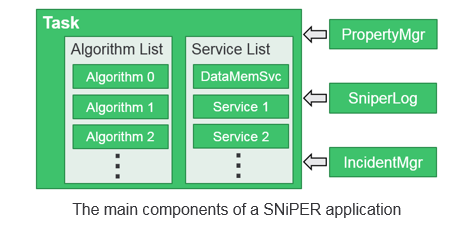

## General Concepts

In SNiPER, users can implement their own modules, which can be loaded and executed dynamically at run time. We call these modules as Dynamically Loadable Elements (DLE). According to the roles they played in SNiPER, DLE modules are further distinguished as algorithms, services and tasks.

> It’s helpful if you are familiar with [Gaudi](http://gaudi.web.cern.ch/gaudi/). There are some similarity. The concepts of algorithm and service in SNiPER are equivalent to that in Gaudi, and task is somewhat like the application manager. However, we will assume our readers as fresh users of any software frameworks. 

Let's consider a general data processing procedure. There are a seqence of events in the data, and we process the events one by one with a loop (the so-called events loop).

```flow
st=>start: Start
e=>end: End
in=>inputoutput: Read an Event
op1=>operation: Process an Event
out=>inputoutput: Save Resule
cond=>condition: More Event ?

st->cond
cond(yes,right)->in(right)->op1(right)->out
cond(no)->e
out(right)->cond
```
There can be a fixed procedure to each event: read in the event data, perform some calculation, and then write out the result. During the calculation, we may occasionally access the detector geometry, database, or anything else. In this application, each subroutine can be implemented as a module, so that they can be assembled and reused easily for different purpose. These subroutines, in SNiPER, are mainly the algorithms and services.

The following show the difference between algorithm and service, and the role of task.

- algorithm: the calculation subroutine that applied to each event, for example, a reconstruction algorithm. Generally it is invoked by the framework during the event loop.
- service: the subroutine to provide a specific functionality, for example, users can access the detector geometry via the specified geometry service. It can be invoked by users' code or the framework whenever we want.
- task: the manager of algorithms and services, and the controller of the event loop. The entrance of a SNiPER application is always a task.

In SNiPER, there are some more assistant functionalities that can be invoked globally, including PropertyMgr, SniperLog and IncidentMgr.

- property: a configurable variable. Users can customize its value during the job configuration, without code modification and re-compiling.
- SniperLog: logs with output levels. Users can selectively print more or less messages, for debugging or production purpose.
- incident: a trigger to the registered subroutines (incident handlers). This is also a concept that taken from Gaudi.

The following picture shows these components togother.

