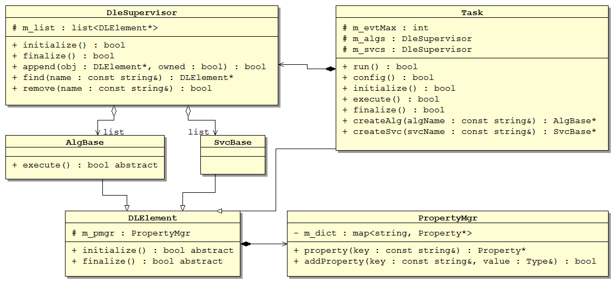

## User Interfaces

In a framework, there are always some conventions to implement a module. Only the legal modules can be recognized by the framework, and be used like plugins.

In SNiPER, the most frequently used concepts are algorithm and service. They are expressed as C++ classes.

- a concrete algorithm class must be inherited from the AlgBase class;
- a concrete service class must be inherithed from the SvcBase class;

Moreover, we have to at least implement the following 3 methods in a concrete algorithm, which are defined as abstract interface in the base classes.

- initialize(): be invoked once by the framework before the event loop. We can add any preparation works here.
- execute(): be invoked once to each event by the framework during the event loop. We can perform the data calculations here.
- finalize(): be invoked once by the framework after the event loop.

It is similar to a concrete service class, except that the SvcBase class doesn't have an abstract execute() method.

The following picture shows the core C++ class diagram in SniperKernel.



Suppose we have implemented an algorithm, then how to use it in our job? This is configured by the Python interface of SNiPER.

Let's take an example, there is a HelloAlg algorithm class in the SNiPER (package Examples/HelloWorld). Then a minimal Python configuration may look like the following code.

```python
#!/usr/bin/env python

import Sniper
task = Sniper.Task("task")  # create a Task instance
task.setEvtMax(3)  # set the number of the event loop
   
import HelloWorld  # load the HelloWorld module into SNiPER
task.property("algs").append("HelloAlg")  # create a HelloAlg instance

#start the processing procedure
#the HelloAlg::execute() will be invoked 3 times during the event loop
task.run()
```
We can save the code in a python script file and execute it directly.

```
$ python run.py
```

We only show the form to configure and execute a SNiPER application here. The details will be described in later setions.