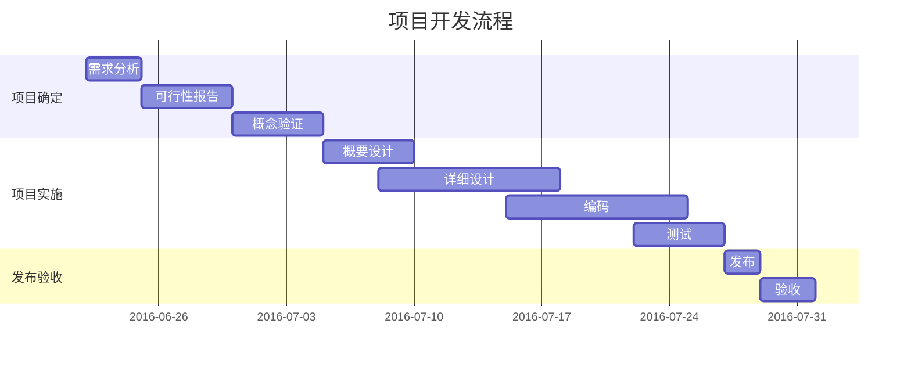
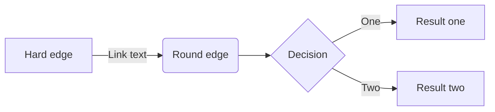
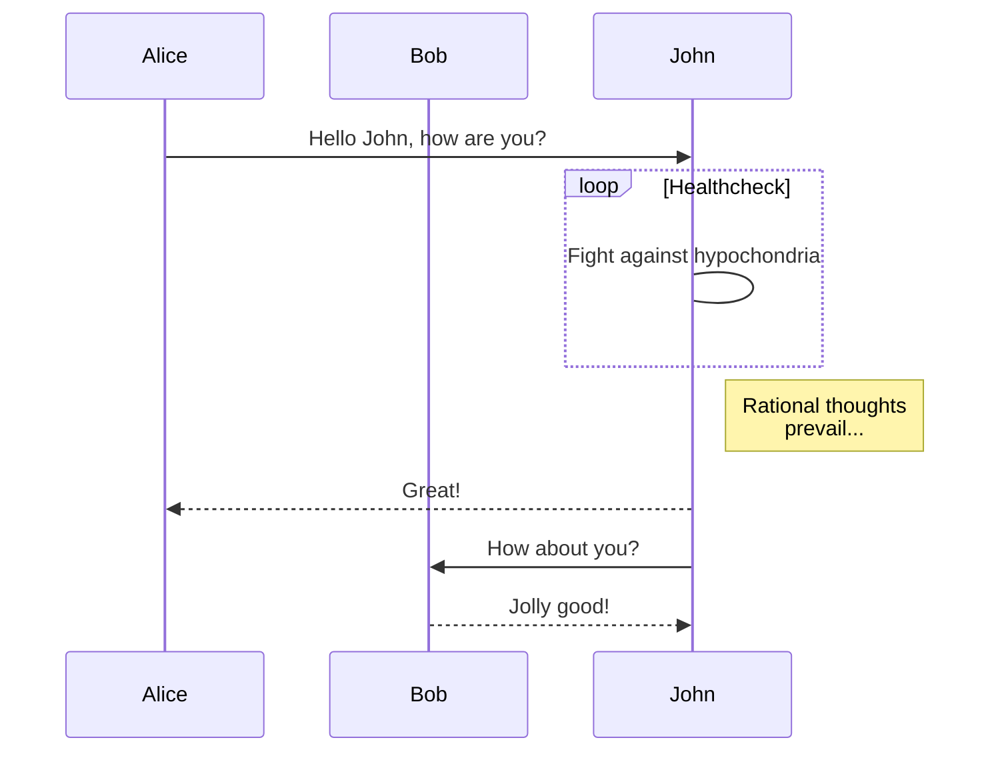

# Test

## Flow chart

---

```flow
st=>start: Start|past:>http://www.google.com[blank]
e=>end: End:>http://www.google.com
op1=>operation: My Operation|past
op2=>operation: Stuff|current
sub1=>subroutine: My Subroutine|invalid
cond=>condition: Yes or No?|approved:>http://www.baidu.com
c2=>condition: Good idea|rejected
io=>inputoutput: catch something...|request

st->op1(right)->cond
cond(yes, right)->c2
cond(no)->sub1(left)->op1
c2(yes)->io->e
c2(no)->op2->e
```

## Sequence

```sequence
Title: Here is a title
A->B: Normal line
B-->C: Dashed line
C->>D: Open arrow
D-->>A: Dashed open arrow
```

```sequence
participant 客户端
participant 服务器
participant 通行证中心
Note over 客户端: 用户输入通行证的账号、密码
客户端->通行证中心: 发送账号、密码
Note over 通行证中心: 验证账号、密码
通行证中心-->>客户端: 返回token
客户端->服务器: 发送token
服务器->通行证中心: 验证token
通行证中心-->>服务器: 验证成功
服务器-->>客户端: 登陆成功
```

## Mermaid-甘特图



## Mermaid-流程图



## Mermaid-序列图


