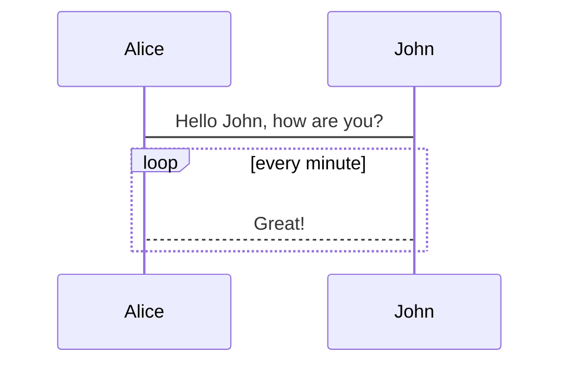

# Test

## Flow chart

---

```flow
st=>start: Start|past:>http://www.google.com[blank]
e=>end: End:>http://www.google.com
op1=>operation: My Operation|past
op2=>operation: Stuff|current
sub1=>subroutine: My Subroutine|invalid
cond=>condition: Yes or No?|approved:>http://www.baidu.com
c2=>condition: Good idea|rejected
io=>inputoutput: catch something...|request

st->op1(right)->cond
cond(yes, right)->c2
cond(no)->sub1(left)->op1
c2(yes)->io->e
c2(no)->op2->e
```

## Sequence

```sequence
Title: Here is a title
A->B: Normal line
B-->C: Dashed line
C->>D: Open arrow
D-->>A: Dashed open arrow
```

## Mermaid-甘特图

```mermaid
gantt;
    title 项目开发流程;
    section 项目确定;
        需求分析       :a1, 2016-06-22, 3d;
        可行性报告     :after a1, 5d;
        概念验证       : 5d;
    section 项目实施;
        概要设计      :2016-07-05  , 5d;
        详细设计      :2016-07-08, 10d;
        编码          :2016-07-15, 10d;
        测试          :2016-07-22, 5d;
    section 发布验收;
        发布: 2d;
        验收: 3d;
```

## Mermaid-流程图


## Mermaid-序列图

